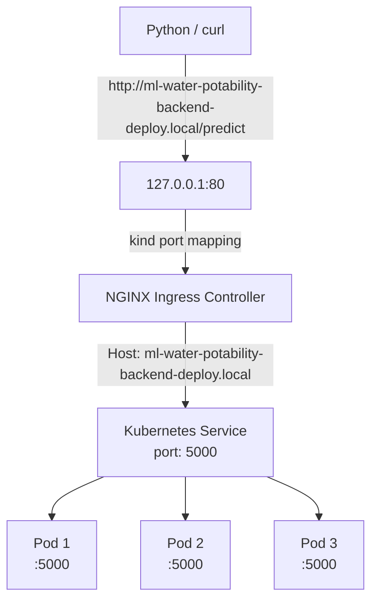

# Deployment with kubernetes (locally)

## Deployment to kubernetes cluster
* The 2 config files [deployment.yaml](deployment.yaml) and [service.yaml](service.yaml) can be used for deploying to kubernetes cluster

## Instructions to setup kubernetes cluster (locally) and deploying the docker image with the FastAPI ML application to the kubernetes cluster
* Install [kubectl](https://docs.aws.amazon.com/eks/latest/userguide/install-kubectl.html) and [kind](https://kind.sigs.k8s.io/docs/user/quick-start/#installation)
* Delete any default kind cluster that may be already be running
```
kind delete cluster --name kind
```
* Setup a kind cluster with the following command
```
kind create cluster --name kind
```
* To check the cluster info, run the following commands
```
kubectl cluster-info --context kind-kind
```
* To check services, pods, deployments; run the following commands
```
kubectl get service
kubectl get pod
kubectl get deployment
```
* Setup NGINX Ingress Controller
```
kubectl apply -f https://raw.githubusercontent.com/kubernetes/ingress-nginx/main/deploy/static/provider/kind/deploy.yaml
```
* Check NGINX Ingress Controller
```
kubectl get pods -n ingress-nginx
```
* Load the docker image for the FastAPI ML application to the kubernetes cluster
```
kind load docker-image ml-water-potability-backend
```
* Setup the deployment, the config for deployment is available in [deployment.yaml](deployment.yaml)
```
kubectl apply -f deploy/deployment.yaml
```
* Check the deployment pods
```
kubectl get pod
```
* Setup the service, the config for service is available in [service.yaml](service.yaml)
```
kubectl apply -f deploy/service.yaml
```
* Check the service
```
kubectl get svc
```
* Setup the ingress, the config for ingress is available in [ingress.yaml](ingress.yaml)
```
kubectl apply -f deploy/ingress.yaml
```
* Check the ingress
```
kubectl get ingress
```
* To delete a deployed pod. Once a pod gets deleted, another pod is automatically spawned
```
kubectl delete pod <pod_name>
```
* Run script to test the post request
```
python3 test_post_request.py
```
* To further scale the deployment to increase or decrease the pods
```
kubectl scale deployment ml-water-potability-backend-deploy --replicas=10
```

## Architecture for deployment

